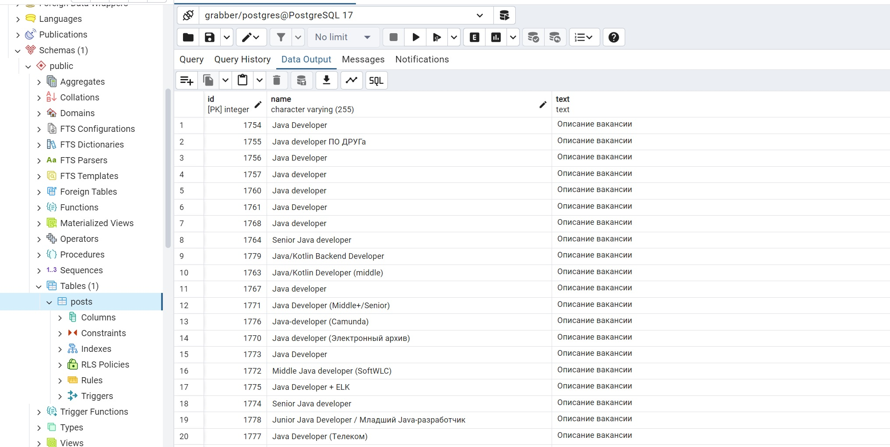

# job4j_grabber

### О проекте
Проект "Агрегатор вакансий".
Система запускается по расписанию - раз в минуту.  Период запуска указывается в настройках.
Первый сайт будет career.habr.com. Работа происходит с разделом https://career.habr.com/vacancies/java_developer.  
Программа считывает все вакансии c первых 5 страниц относящиеся к Java и записывать их в базу.
Также:
1. В проект можно добавить новые сайты без изменения кода.
2. В проекте можно сделать параллельный парсинг сайтов.

### Стек технологий
Java 17, JUnit 5, Log4j 1.2.17, Liquibase 4.28.0, PostgreSQL 42, H2 2.2.224, Jsoup 1.17.2, Quartz 2.3.2

### Требования к окружению
Java 17, Maven 3.4.0, PostgreSQL

### Запуск проекта
``` create database grabber;  ```
``` mvn clean install  ```
и далее запускаем приложение

### Взаимодействие с приложением

#### Скриншоты

##### *Результаты работы программы*



### Контакты


- Telegram: [@OlgaIlyina0312](https://t.me/OlgaIlyina0312)
- Email:    [oliljina@mail.ru](oliljina@mail.ru)